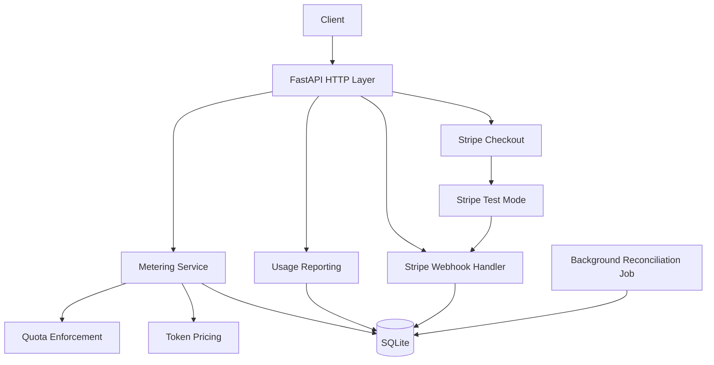

# Usage Metering & Billing Engine

A multi-tenant FastAPI backend demonstrating idempotent usage metering, monthly quota enforcement, AI token cost tracking, Stripe subscription upgrades, verified webhook processing, and background usage reconciliation.

The project uses Stripe test/sandbox mode only. No live payments are used.

## Features

- Free and Pro subscription plans
- Monthly API-call and AI-token quotas
- Tenant-scoped idempotent usage metering
- Exact quota-boundary enforcement
- Integer-only AI cost accounting
- Separate input, cached-input, output, and reasoning token tracking
- Stripe Checkout for Free-to-Pro upgrades
- Stripe webhook signature verification and event deduplication
- Subscription lifecycle synchronization
- SQLite persistence with SQL migrations and indexes
- Background usage reconciliation with retries and failure logging

## Architecture



The HTTP layer accepts and validates requests. Metering, pricing, quota, Stripe, and reporting concerns are separated into service modules. SQLite provides durable local persistence.

## Plans

| Plan | API calls/month | AI tokens/month |
| --- | ---: | ---: |
| Free | 1,000 | 100,000 |
| Pro | 10,000 | 1,000,000 |

Usage exactly equal to the monthly limit is allowed. A request that would exceed the limit is rejected with HTTP 429.

## AI Pricing Model

The project pins Gemini 2.5 Flash Standard pricing for text usage:

| Category | USD per 1M tokens |
| --- | ---: |
| Input | $0.30 |
| Cached input | $0.03 |
| Output | $2.50 |
| Reasoning/thinking | $2.50 |

Reasoning/thinking tokens use the output-token rate. Costs are stored as integer microdollars rather than floating-point currency.

For this project, `input_tokens` means non-cached input tokens and `cached_input_tokens` is tracked separately.

AI token counts are simulated; the application does not call Gemini.

## Project Structure

```text
main.py                 FastAPI routes
metering.py             Idempotent metering and quota enforcement
usage.py                Monthly usage and cost reporting
pricing.py              Pinned integer token pricing
quota.py                Quota-checking service
stripe_service.py       Stripe Checkout creation
stripe_webhook.py       Webhook verification and processing
database.py             SQLite connection
migrate.py              SQL migration runner
seed.py                 Demo data
background_jobs.py      Usage reconciliation worker
migrations/             Versioned database migrations
DESIGN.md               System design
EVIDENCE.md             Acceptance evidence
BUILDLOG.md             Implementation log
capstone.yaml           Project metadata
```

## Local Setup

Requires Python 3.11+.

```bash
git clone https://github.com/aadsj12/flyrank-capstone-metering-billing.git
cd flyrank-capstone-metering-billing

python -m venv .venv
source .venv/bin/activate
pip install -r requirements.txt

cp .env.example .env
```

Configure these Stripe test/sandbox values in `.env`:

```text
STRIPE_SECRET_KEY=
STRIPE_WEBHOOK_SECRET=
STRIPE_PRO_PRICE_ID=
```

Never use live Stripe credentials for this project.

## Database Setup

For a fresh local setup:

```bash
python seed.py
```

The seed command runs unapplied migrations and creates Free and Pro plans, a demo tenant, and an active Free subscription.

`seed.py` resets demo data, so do not run it when existing local test evidence needs to be preserved.

## Run the API

```bash
uvicorn main:app --reload
```

Health check:

```bash
curl http://127.0.0.1:8000/health
```

## Meter an API Call

```bash
curl -X POST "http://127.0.0.1:8000/generate" \
  -H "Content-Type: application/json" \
  -d '{
    "tenant_id": 1,
    "usage_type": "api_call",
    "quantity": 1,
    "idempotency_key": "request-001"
  }'
```

Reusing the same tenant and idempotency key returns the stored event instead of recording the usage twice.

## Meter AI Tokens

```bash
curl -X POST "http://127.0.0.1:8000/generate" \
  -H "Content-Type: application/json" \
  -d '{
    "tenant_id": 1,
    "usage_type": "ai_token",
    "idempotency_key": "ai-request-001",
    "input_tokens": 1000,
    "cached_input_tokens": 1000,
    "output_tokens": 1000,
    "reasoning_tokens": 1000
  }'
```

## View Usage

```bash
curl "http://127.0.0.1:8000/usage?tenant_id=1"
```

The response reports current-month usage, plan limits, remaining quota, token-category totals, and AI cost in integer microdollars.

## Stripe Checkout

Start Stripe webhook forwarding in another terminal. The setup used during development was:

```bash
npm install @stripe/cli
npx stripe login

npx stripe listen \
  --events checkout.session.completed,customer.subscription.created,customer.subscription.updated,customer.subscription.deleted \
  --forward-to http://127.0.0.1:8000/webhooks/stripe
```

Copy the listener's webhook signing secret into `STRIPE_WEBHOOK_SECRET` in `.env` and restart the API.

Create a Checkout Session:

```bash
curl -X POST "http://127.0.0.1:8000/checkout?tenant_id=1"
```

Open the returned Checkout URL and complete the flow using Stripe sandbox/test payment details.

A valid completed Checkout webhook upgrades the tenant to Pro. Subscription lifecycle events subsequently synchronize subscription state.

## Webhook Security

The webhook endpoint:

1. requires a Stripe signature;
2. verifies the signature using the webhook signing secret;
3. rejects missing or invalid signatures with HTTP 400;
4. persists processed Stripe event IDs;
5. ignores replayed event IDs transactionally.

Usage events separately enforce a unique `(tenant_id, idempotency_key)` constraint.

## Background Reconciliation

Run the background worker independently from the API request path:

```bash
python background_jobs.py
```

The job summarizes current-month usage by tenant. Failed executions are retried up to three times, after which a critical failure alert is logged.

## Limitations

This project intentionally does not implement:

- live Stripe payments
- invoice generation
- proration
- overage billing
- tax calculation
- real Gemini inference
- distributed job queues
- production authentication

Token usage is simulated so metering, quota, idempotency, and cost behavior can be tested deterministically.

In production, SQLite would typically be replaced by a server database, background work would use durable job infrastructure, and tenant identity would come from authenticated application context rather than a request-supplied tenant ID.
